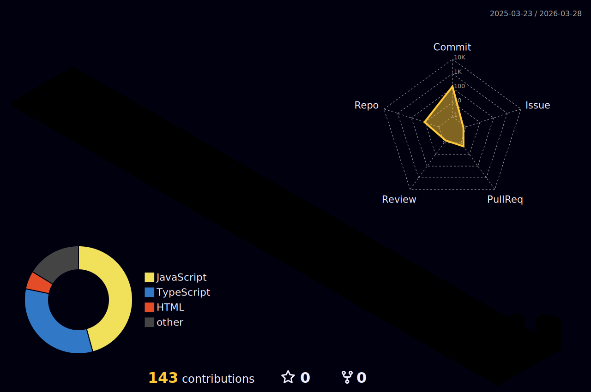

<div align="center">


[](https://git.io/typing-svg)

<br/>

[](https://www.linkedin.com/in/mirko-baron-vedia-7702663b2)
[](https://mail.google.com/mail/?view=cm&to=baronvedia@gmail.com)


</div>

---

## 🙋 Sobre mí
```yaml
nombre:     Mirko Baron Vedia
rol:        Estudiante de Ingeniería en Sistemas — UTEPSA
ubicacion:  Santa Cruz de la Sierra, Bolivia
intereses:  IA, automatización, Web3, desarrollo web
estado:     Aprendiendo, construyendo y rompiendo cosas
```

- 🎓 Estudiante de **Ingeniería en Sistemas** en la UTEPSA
- 🤖 Me manejo muy bien con **herramientas de IA** — Claude, Claude Code, Codex, Antigravity
- 🛠️ Construyo proyectos con **Node.js, JavaScript y APIs de IA**
- - 🇬🇧 Inglés **B1** — lectura y escritura fluida, mejorando constantemente
- 📖 Aprendiendo constantemente — no domino ningún lenguaje del todo, pero avanzo rápido
- 💡 Me interesa usar IA para **automatizar procesos reales**

---

## 🛠️ Herramientas que uso

<div align="center">

**IA & Agentes**


**Lenguajes (en progreso 📚)**


**Entorno & DevOps**


</div>

---

## 📊 GitHub Stats

<div align="center">


</div>

<div align="center">

[](https://git.io/streak-stats)

</div>

---

<div align="center">


</div>

## 🌐 3D Contribution Calendar

<div align="center">
  
</div>
